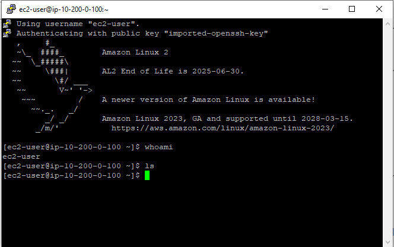

# 🚀 AWS CLI Installation & IAM Management on EC2 💻

## 📖 Description
This project demonstrates the installation, configuration, and use of the AWS Command Line Interface (AWS CLI) to manage Identity and Access Management (IAM) resources on a Red Hat Linux EC2 instance. It’s a hands-on exercise designed to showcase essential AWS CLI skills, including connecting to an EC2 instance, configuring the CLI, and retrieving IAM user and policy details programmatically.

## 🎯 Objectives

By completing this project, I:

1. **Installed and configured the AWS CLI** on a Red Hat Linux EC2 instance.
2. **Connected the AWS CLI to an AWS account** using IAM credentials.
3. **Retrieved IAM user and policy details** programmatically through the AWS CLI.

## 🛠️ Prerequisites

Before starting this project, ensure you have the following:

1. **AWS Account**: An active AWS account to access the Management Console.
2. **PuTTY**: A tool for SSH access (Windows users only).  
   - Download here: [PuTTY Download](https://www.putty.org/).
3. **Access Credentials**: AWS Access Key and Secret Key (provided during the lab).
4. **Basic Knowledge**: Familiarity with the AWS Management Console and basic command-line usage.

## 📜 Steps

### 1️⃣ Connect to EC2 via SSH
Accessed the Red Hat Linux EC2 instance using **PuTTY** to establish an SSH connection.

**Command:**

whoami

**Output:**
ec2-user 🎉 Connected successfully!

**Screenshot:**
.

### 2️⃣ Check AWS CLI Installation
Verified if AWS CLI was pre-installed on the instance.

Command:

aws --version

**Output:**
AWS CLI version details confirmed pre-installation. 🥳

**Screenshot:**
[AWS CLI Version details](./assets/p3.PNG).

### 3️⃣ Configure the AWS CLI
Configured the AWS CLI with access credentials.

**Command:**

aws configure

**Details:**

Access Key ID: Provided during the lab.
Secret Access Key: Provided during the lab.
Default Region: us-west-2
Output Format: json

**Screenshot:**
[AWS CLI with credentials](./assets/p4.PNG).

### 4️⃣ List IAM Users
Retrieved the IAM users in the account.

**Command:**

aws iam list-users

**Output:**

awsstudent user was listed and properly configured.

### 5️⃣ Retrieve IAM Policies
Retrieved policy details for the lab_policy document.

**Commands:**

**List Policies:**

aws iam list-policies --scope Local

**Get Policy Version:**

aws iam get-policy-version --policy-arn <policy-arn> --version-id <version-id> > lab_policy.json

**View Policy Output:**

cat lab_policy.json

**Screenshot:**
[Retrieved policy details for the lab_policy document](./assets/p5.PNG).

##🏁 Conclusion
This project was a fantastic introduction to AWS CLI and IAM management. Here's what I achieved:

✅ Installed and configured the AWS CLI.
✅ Connected to AWS with IAM credentials.
✅ Retrieved IAM policies programmatically.
Looking forward to more AWS adventures! 🌈

## 📚 References

AWS CLI Documentation
IAM CLI Commands